# Power

An autonomous engineering team whose **stage boundaries are decided by code**,
running on your own Claude login. Describe a goal; specialists run
research → spec → **approval** → implement → review → test → verify → document,
with deterministic gates between stages, counted retries, cost you can see and
cap, and a first-party router that sends cheap work to the providers you bring.

One brain, many shells. This README is the complete map — architecture, flow,
and every moving part, with diagrams.

---

## Table of contents

- [The idea in one picture](#the-idea-in-one-picture)
- [System architecture](#system-architecture)
- [The pipeline, end to end](#the-pipeline-end-to-end)
- [Anatomy of a dispatch](#anatomy-of-a-dispatch)
- [Gates: the part an agent cannot argue with](#gates-the-part-an-agent-cannot-argue-with)
- [Relay: Power's own inference router](#relay-powers-own-inference-router)
- [Provider routing & cost modes](#provider-routing--cost-modes)
- [The agent prompt system](#the-agent-prompt-system)
- [Speed: the express pipeline](#speed-the-express-pipeline)
- [Runtime & bundling](#runtime--bundling)
- [The surfaces](#the-surfaces)
- [Quick start](#quick-start)
- [Repository map](#repository-map)
- [What makes the output trustworthy](#what-makes-the-output-trustworthy)

---

## The idea in one picture

Power is a **control plane** wrapped around a fixed, gated agent workflow. The
model does the thinking; **code** decides when a stage is allowed to end. Every
artifact an agent writes is judged by a deterministic gate before the run moves
on, and nothing routes anywhere or spends anything you didn't choose.

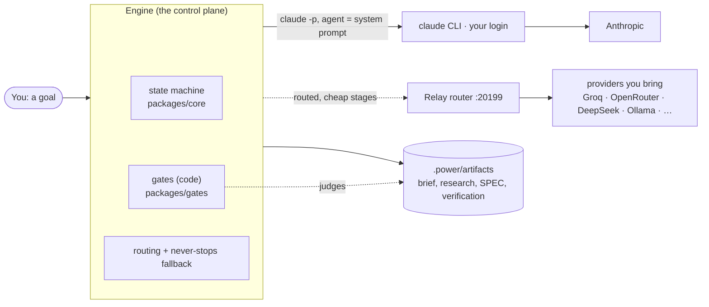

Two invariants hold the whole thing together:

1. **Agents cannot see, edit, or argue with a gate.** Gates are pure functions
   over the files on disk (`packages/gates`), run by the engine, not the model.
2. **No credential custody.** Every dispatch rides your `claude` CLI OAuth login;
   Power holds no keys of its own. (Upstream provider keys you add for Relay live
   app-private on your machine, never in the repo.)

---

## System architecture

One TypeScript **brain** is compiled into a dependency-free runtime that every
shell resolves by identical relative paths (ADR 0004). A shell is just an engine
that drives that runtime and renders progress.

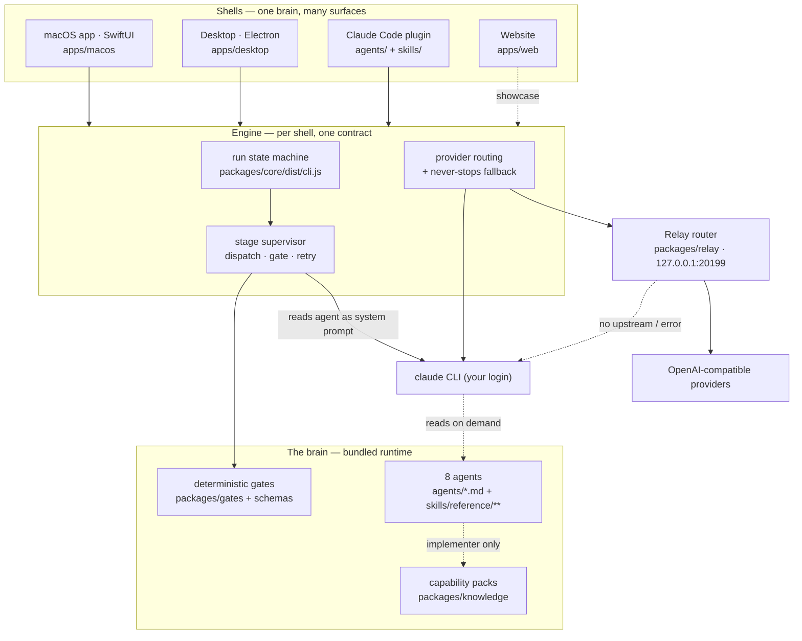

| Layer | Lives in | Job |
|---|---|---|
| **Shells** | `apps/macos`, `apps/desktop`, `agents/`+`skills/`, `apps/web` | Launch runs, render progress, own no logic the others don't |
| **Engine** | `apps/*/…/engine` (Swift & TS twins) | Drive the state machine, dispatch stages, run gates, route, fall back |
| **State machine** | `packages/core` | The only writer of the run state file; a reducer that refuses illegal transitions |
| **Gates** | `packages/gates` (+ `schemas/`) | Judge artifacts on disk; schema + cross-field rules; pass/fail with quoted violations |
| **Agents** | `packages/agents` → `agents/*.md` + `skills/` | The eight role prompts and their on-demand playbooks |
| **Knowledge** | `packages/knowledge` | Capability packs the implementer can pull in at build time |
| **Relay** | `packages/relay` | First-party Anthropic-compatible router to cheap providers |

---

## The pipeline, end to end

Every run walks the same stations. Gates sit at **research**, **spec**, and
**verification**; a human (or auto) approval sits after the spec; the
**never-stops** rule means a failed dispatch falls back to your Claude login
rather than dying. Simple goals take the **express** shortcut (see below).

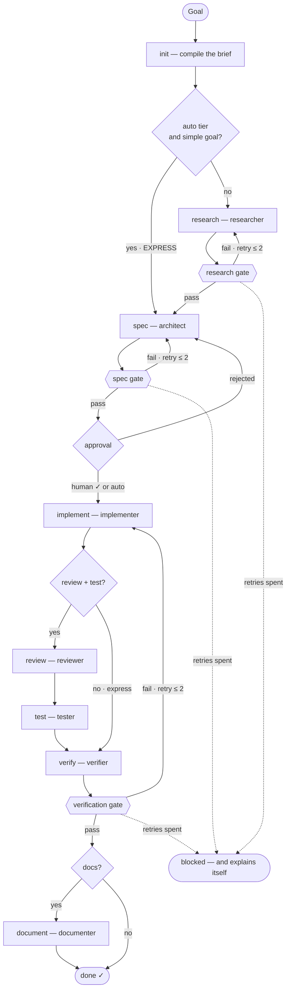

- **Gates** (`{{ … }}`) are code. A stage cannot pass its gate by asserting it did.
- **Retries fix, never redo** — the retry brief quotes the *specific* rule
  violations (and now the offending value), caps at 2, then the run **blocks and
  explains itself** rather than looping or lying.
- **Honest skips** — run options can turn research, review/test, or docs off; the
  record says `skipped`, never `pass`. **Verify has no off switch.**

---

## Anatomy of a dispatch

Each stage is one `claude -p` process with the role's `agents/<role>.md` as its
system prompt. The engine chooses a provider first, runs the model, then judges
the result with a gate — and if the provider fails, it falls back to your Claude
login without stopping the run.

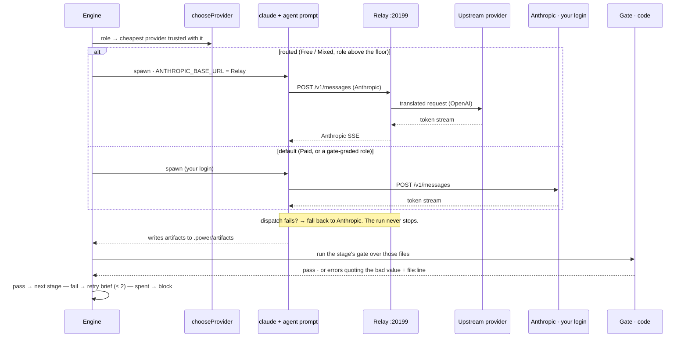

---

## Gates: the part an agent cannot argue with

Gates (`packages/gates`) are the reason the output is trustworthy. They are pure
functions over the artifacts on disk — **JSON-schema validation plus cross-field
rules** — run by the engine, invisible and unwritable to the model.

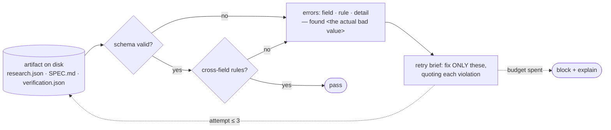

- Three gated stages: **research**, **spec**, **verification** (schemas in
  `packages/gates/schemas/`).
- A schema failure now **quotes what the model actually wrote** (`— found "16"`),
  so a retry can converge instead of guessing at the same broken value.
- Golden **and** broken fixtures are asserted in both directions; the export step
  refuses to ship if a gate ever passes a broken fixture.

---

## Relay: Power's own inference router

Relay (`packages/relay`) is a small **first-party** HTTP server bundled inside
the runtime — no install, no third-party dependency. It speaks the Anthropic
Messages API in (what `claude` sends via `ANTHROPIC_BASE_URL`) and translates to
any OpenAI-compatible provider out, compressing on the way.

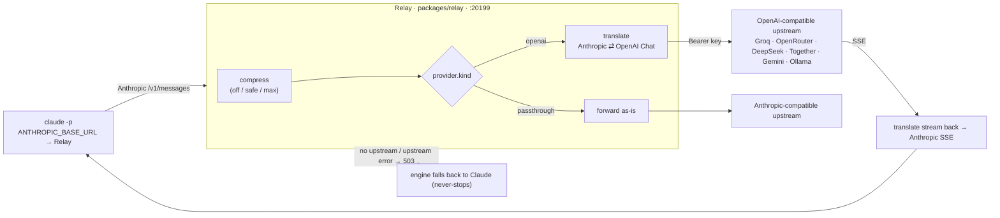

- Endpoints: `POST /v1/messages` (streaming + non-streaming), `GET /health`,
  `GET /stats` (requests served, characters saved by compression).
- **Compression** trims only oversized `tool_result` output (re-derivable machine
  noise) — never user text, the system prompt, tools, or code.
- Because a bad routed stage returns non-2xx and the run falls back to Claude,
  **Relay is safe to ship even when imperfect.**
- Manage it in **Routing**: Start/Stop, compression, and bring-your-own upstream
  providers (name · base URL · key · model map). Keys stay app-private.

---

## Provider routing & cost modes

Routing lets you spend Claude only where it's worth it. Each provider declares a
**quality floor** — the roles it is trusted with — and the lowest-cost eligible
provider wins per role. Code-writing and gate-graded roles stay on your trusted
Claude login unless you widen the floor yourself.

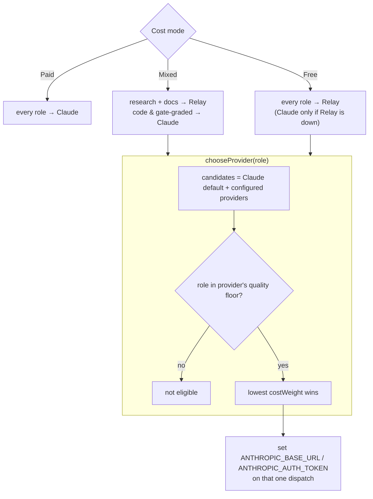

- The redirect is just two environment variables Claude Code already reads —
  `ANTHROPIC_BASE_URL` and `ANTHROPIC_AUTH_TOKEN` — set per dispatch (ADR 0006).
- The safe default floor is research + docs (`safeCheapRoles`); a miss there is
  caught by a later gate or is low-stakes prose.
- Cost is **visible and bounded**: per-role models, Eco/Balanced/Max tiers, turn
  caps, per-stage `$` from stream-json, and a Stop that kills the active dispatch.

---

## The agent prompt system

The eight agent prompts are **compiled**, not hand-written. Source blocks in
`packages/agents/prompts/<role>.md` are split by the build into two kinds:
**core blocks** stay inline in `agents/<role>.md` (always in the system prompt),
and everything else becomes an **on-demand reference playbook** under
`skills/power/reference/<role>/` that the agent reads only when the moment
arrives — keeping the prompt lean without losing depth.

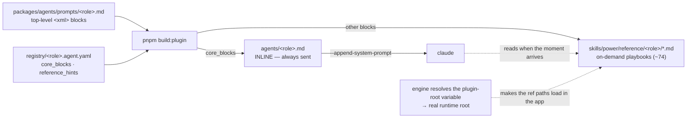

- **`${CLAUDE_PLUGIN_ROOT}` is resolved by the engine.** The prompts reference
  their playbooks by that variable, which only Claude Code's plugin host sets.
  Since Power runs `claude` headless, both engines substitute it for the real
  runtime root at dispatch — otherwise the reference playbooks (an agent's real
  operating detail) never load in the app.
- **Playbooks borrowed from [gstack](https://github.com/garrytan/gstack)**, adapted
  to Power's autonomous model and shipped as inline core blocks:
  - architect · **product interrogation** — challenge the premise, find the
    narrowest wedge, weigh and record alternatives before speccing.
  - reviewer · **security audit** — "think like an attacker, report like a
    defender": input→sink, authz, secrets, SSRF, prompt injection, supply chain,
    each with a concrete exploit path + `file:line`.
  - implementer · **design conviction** — the anti-convergence rule: never ship
    the generic default; commit to one intentional, coherent direction.
- To change an agent, **edit the prompt, not the generated file**, then
  `pnpm --filter @power/agents build:plugin`. The build rewrites `agents/` and
  `skills/` and enforces that every reference file is pointed at exactly once.

---

## Speed: the express pipeline

A small prompt should not pay for a seven-stage pipeline — each stage is a
separate cold `claude` round-trip. So the default **auto** tier, faced with a
simple goal, runs **express**: spec → implement → verify, auto-approved. Three
model calls instead of seven, dropping the slowest stages, while **verify (the
deploy gate) always survives**. An explicit tier (Eco/Balanced/Max) is honored
verbatim, and a complex goal keeps the full pipeline even on auto.

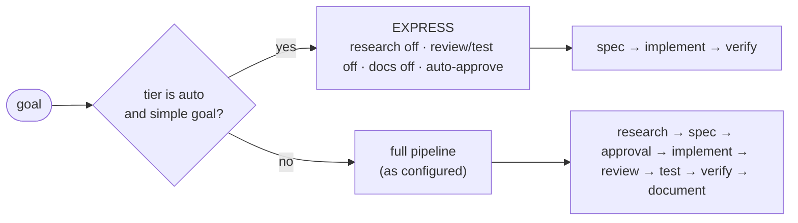

---

## Runtime & bundling

The brain ships as a **dependency-free runtime** the app spawns with the `node`
already on the machine — no `node_modules`, no `pnpm` on the destination.

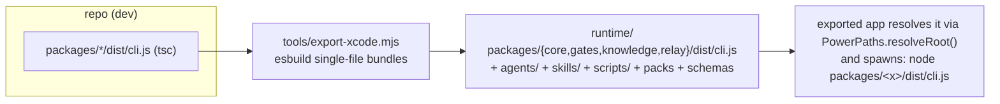

- CLIs (`core`, `gates`, `knowledge`, `relay`) are esbuilt into single files;
  `agents/`, `skills/`, `scripts/`, packs and schemas ride along so reference
  playbooks and the gate script resolve in the standalone app.
- The export is **self-verifying**: it runs the bundled CLIs (state init, a gate
  in both directions) from a temp dir and fails the export if a bundle is broken.

---

## The surfaces

| Surface | Where | Try it |
|---|---|---|
| Claude Code plugin | `agents/` + `skills/` (generated from `packages/agents`) | `/plugin marketplace add <repo>` → `/plugin install power` → `/power build "…"` |
| Mac app (native Swift) | `apps/macos` | open `Power.xcodeproj` · standalone export: `pnpm export:xcode` |
| Mac app (Electron) | `apps/desktop` | `pnpm dev:desktop` · package: `pnpm package:desktop` |
| Website | `apps/web` | `pnpm dev:web` · static export: `pnpm build:web` |

---

## Quick start

```bash
pnpm install
pnpm check        # typecheck (builds the CLIs) + registry validation + tests (346)
```

Run a full pipeline **without spending a token**: set `POWER_MOCK_AGENTS=1` for
either app — mock agents write real artifacts, and the real gates judge them.

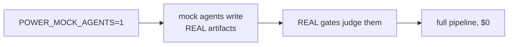

---

## Repository map

```
docs/            architecture + ADRs — read ARCHITECTURE.md before moving anything
packages/        the brain:
  core/            run state machine + reducer (the only state writer)
  gates/           deterministic gates + JSON schemas
  agents/          agent prompt sources + compiler (build:plugin)
  knowledge/       capability packs + selector
  relay/           first-party Anthropic-compatible inference router
apps/            the shells: macos (Swift) · desktop (Electron) · web · orchestrator (dormant hosted path)
agents/ skills/  GENERATED plugin surface — edit packages/agents, run pnpm build:plugin
scripts/         plugin runtime wrappers (part of the runtime ABI)
tools/           repo tooling (export-xcode.mjs)
```

Contributor guide: [CONTRIBUTING.md](CONTRIBUTING.md). Deeper prose and decisions
with consequences: [docs/ARCHITECTURE.md](docs/ARCHITECTURE.md) and
[docs/adr/](docs/adr/). License: proprietary, see [LICENSE](LICENSE).

---

## What makes the output trustworthy

1. **Gates are code** (`packages/gates`) — schema + cross-field rules over the
   files on disk. An agent cannot see, edit, or argue with a gate.
2. **Retries fix, never redo**, quote the exact violation, are counted, cap at 2,
   then the run **blocks and explains itself**.
3. **One approval** (the spec); the state machine refuses it before the spec gate
   has passed. Express auto-approves trivial goals; it can never loosen a gate.
4. **Honest skips** — options turn stages off and the record says `skipped`,
   never `pass`. Verify has no off switch.
5. **No credential custody** — every dispatch rides your `claude` CLI OAuth login.
6. **Visible, bounded cost** — per-role models, tiers, turn caps, per-stage `$`
   from stream-json, a Stop that kills the active dispatch, and a first-party
   router that sends cheap work to providers you bring.
